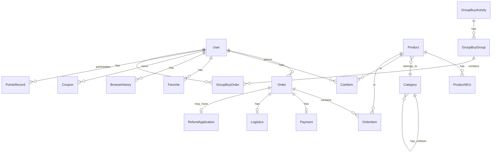

# 设计文档

## 概述

本项目是一个综合性电商平台，采用前后端分离架构：
- **小程序端**：微信小程序，使用 uni-app 框架开发，支持跨平台
- **管理后台**：Web 应用，使用 Vue 3 + Element Plus 开发
- **后端服务**：Node.js + Express/Koa，提供 RESTful API
- **数据库**：MySQL 存储业务数据，Redis 缓存热点数据

## 架构设计

```mermaid
graph TB
    subgraph 客户端
        MP[微信小程序]
        Admin[管理后台Web]
    end
    
    subgraph 后端服务
        API[API Gateway]
        UserService[用户服务]
        ProductService[商品服务]
        OrderService[订单服务]
        PaymentService[支付服务]
        MarketingService[营销服务]
    end
    
    subgraph 数据层
        MySQL[(MySQL)]
        Redis[(Redis)]
        OSS[对象存储]
    end
    
    MP --> API
    Admin --> API
    API --> UserService
    API --> ProductService
    API --> OrderService
    API --> PaymentService
    API --> MarketingService
    
    UserService --> MySQL
    ProductService --> MySQL
    OrderService --> MySQL
    PaymentService --> MySQL
    MarketingService --> MySQL
    
    UserService --> Redis
    ProductService --> Redis
    OrderService --> Redis


## 组件与接口

### 1. 用户服务 (UserService)

负责用户认证、个人信息、会员权益管理。

```typescript
interface UserService {
  // 用户认证
  login(code: string): Promise<LoginResult>;
  getUserInfo(userId: string): Promise<User>;
  updateUserInfo(userId: string, data: UserUpdateDTO): Promise<User>;
  
  // 会员权益
  getBalance(userId: string): Promise<BalanceInfo>;
  getPoints(userId: string): Promise<PointsInfo>;
  getCoupons(userId: string, status?: CouponStatus): Promise<Coupon[]>;
  
  // 签到
  checkIn(userId: string): Promise<CheckInResult>;
  getCheckInStatus(userId: string): Promise<CheckInStatus>;
  
  // 收藏与浏览
  getFavorites(userId: string, page: number): Promise<PaginatedResult<Product>>;
  addFavorite(userId: string, productId: string): Promise<void>;
  removeFavorite(userId: string, productId: string): Promise<void>;
  getBrowseHistory(userId: string, page: number): Promise<PaginatedResult<Product>>;
  
  // 分销
  getIncome(userId: string): Promise<IncomeInfo>;
  getIncomeDetails(userId: string, page: number): Promise<PaginatedResult<IncomeRecord>>;
  requestWithdraw(userId: string, amount: number): Promise<WithdrawResult>;
  generateShareLink(userId: string, productId: string): Promise<string>;
}

interface User {
  id: string;
  nickname: string;
  avatar: string;
  phone?: string;
  memberLevel: MemberLevel;
  balance: number;
  points: number;
  createdAt: Date;
}

enum MemberLevel {
  NORMAL = 'normal',
  VIP = 'vip',
  SVIP = 'svip'
}

enum CouponStatus {
  AVAILABLE = 'available',
  USED = 'used',
  EXPIRED = 'expired'
}
```

### 2. 商品服务 (ProductService)

负责商品、分类、搜索管理。

```typescript
interface ProductService {
  // 分类
  getCategories(): Promise<Category[]>;
  getSubCategories(parentId: string): Promise<Category[]>;
  
  // 商品查询
  getProducts(query: ProductQuery): Promise<PaginatedResult<Product>>;
  getProductDetail(productId: string): Promise<ProductDetail>;
  searchProducts(keyword: string, page: number): Promise<PaginatedResult<Product>>;
  
  // 首页配置
  getHomeBanners(): Promise<Banner[]>;
  getHotProducts(): Promise<Product[]>;
  getCategoryShortcuts(): Promise<CategoryShortcut[]>;
  
  // 后台管理
  createProduct(data: ProductCreateDTO): Promise<Product>;
  updateProduct(productId: string, data: ProductUpdateDTO): Promise<Product>;
  updateProductStatus(productId: string, status: ProductStatus): Promise<void>;
  deleteProduct(productId: string): Promise<void>;
  
  // 分类管理
  createCategory(data: CategoryCreateDTO): Promise<Category>;
  updateCategory(categoryId: string, data: CategoryUpdateDTO): Promise<Category>;
  deleteCategory(categoryId: string): Promise<void>;
}

interface Product {
  id: string;
  name: string;
  price: number;
  originalPrice?: number;
  mainImage: string;
  images: string[];
  categoryId: string;
  stock: number;
  sales: number;
  status: ProductStatus;
}

interface ProductDetail extends Product {
  description: string;
  detailImages: string[];
  specs: ProductSpec[];
  skus: ProductSKU[];
}

interface ProductSpec {
  name: string;
  values: string[];
}

interface ProductSKU {
  id: string;
  specValues: string[];
  price: number;
  stock: number;
}

interface Category {
  id: string;
  name: string;
  icon?: string;
  parentId?: string;
  sort: number;
  children?: Category[];
}

enum ProductStatus {
  DRAFT = 'draft',
  ON_SALE = 'on_sale',
  OFF_SALE = 'off_sale'
}
```

### 3. 购物车服务 (CartService)

```typescript
interface CartService {
  getCart(userId: string): Promise<CartItem[]>;
  addToCart(userId: string, item: AddCartDTO): Promise<CartItem>;
  updateCartItem(userId: string, itemId: string, quantity: number): Promise<CartItem>;
  removeCartItem(userId: string, itemId: string): Promise<void>;
  clearCart(userId: string): Promise<void>;
  getCartCount(userId: string): Promise<number>;
}

interface CartItem {
  id: string;
  productId: string;
  skuId: string;
  productName: string;
  productImage: string;
  specValues: string[];
  price: number;
  quantity: number;
  selected: boolean;
  stock: number;
}

interface AddCartDTO {
  productId: string;
  skuId: string;
  quantity: number;
}
```

### 4. 订单服务 (OrderService)

```typescript
interface OrderService {
  // 订单创建
  createOrder(userId: string, data: CreateOrderDTO): Promise<Order>;
  
  // 订单查询
  getOrders(userId: string, status?: OrderStatus, page?: number): Promise<PaginatedResult<Order>>;
  getOrderDetail(orderId: string): Promise<OrderDetail>;
  
  // 订单操作
  cancelOrder(orderId: string): Promise<void>;
  confirmReceive(orderId: string): Promise<void>;
  applyRefund(orderId: string, data: RefundDTO): Promise<RefundApplication>;
  
  // 评价
  submitReview(orderId: string, data: ReviewDTO): Promise<Review>;
  getReviews(userId: string, page: number): Promise<PaginatedResult<Review>>;
  
  // 后台管理
  getAllOrders(query: OrderQuery): Promise<PaginatedResult<Order>>;
  shipOrder(orderId: string, logistics: LogisticsDTO): Promise<void>;
  handleRefund(refundId: string, approved: boolean, reason?: string): Promise<void>;
}

interface Order {
  id: string;
  orderNo: string;
  userId: string;
  status: OrderStatus;
  totalAmount: number;
  payAmount: number;
  discountAmount: number;
  items: OrderItem[];
  createdAt: Date;
  paidAt?: Date;
  shippedAt?: Date;
  completedAt?: Date;
}

interface OrderItem {
  productId: string;
  skuId: string;
  productName: string;
  productImage: string;
  specValues: string[];
  price: number;
  quantity: number;
}

enum OrderStatus {
  PENDING_PAYMENT = 'pending_payment',
  PENDING_SHIPMENT = 'pending_shipment',
  SHIPPED = 'shipped',
  COMPLETED = 'completed',
  CANCELLED = 'cancelled',
  REFUNDING = 'refunding',
  REFUNDED = 'refunded'
}

interface CreateOrderDTO {
  items: { cartItemId: string }[];
  addressId: string;
  couponId?: string;
  usePoints?: number;
  useBalance?: number;
  remark?: string;
}
```


### 5. 拼团服务 (GroupBuyService)

```typescript
interface GroupBuyService {
  // 拼团活动
  getGroupBuyActivities(page: number): Promise<PaginatedResult<GroupBuyActivity>>;
  getGroupBuyDetail(activityId: string): Promise<GroupBuyActivityDetail>;
  
  // 拼团操作
  initiateGroupBuy(userId: string, activityId: string): Promise<GroupBuyOrder>;
  joinGroupBuy(userId: string, groupId: string): Promise<GroupBuyOrder>;
  getMyGroupBuys(userId: string, status?: GroupBuyStatus): Promise<GroupBuyOrder[]>;
  
  // 后台管理
  createActivity(data: GroupBuyActivityDTO): Promise<GroupBuyActivity>;
  updateActivity(activityId: string, data: GroupBuyActivityDTO): Promise<GroupBuyActivity>;
  getActivityStats(activityId: string): Promise<GroupBuyStats>;
}

interface GroupBuyActivity {
  id: string;
  productId: string;
  product: Product;
  groupPrice: number;
  originalPrice: number;
  requiredCount: number;
  timeLimit: number; // 小时
  startTime: Date;
  endTime: Date;
  status: ActivityStatus;
}

interface GroupBuyOrder {
  id: string;
  groupId: string;
  userId: string;
  activityId: string;
  status: GroupBuyStatus;
  currentCount: number;
  requiredCount: number;
  expireTime: Date;
  participants: GroupBuyParticipant[];
}

enum GroupBuyStatus {
  IN_PROGRESS = 'in_progress',
  SUCCESS = 'success',
  FAILED = 'failed'
}

enum ActivityStatus {
  NOT_STARTED = 'not_started',
  ACTIVE = 'active',
  ENDED = 'ended'
}
```

### 6. 支付服务 (PaymentService)

```typescript
interface PaymentService {
  // 支付
  createPayment(orderId: string, paymentMethod: PaymentMethod): Promise<PaymentInfo>;
  handlePaymentCallback(data: PaymentCallbackDTO): Promise<void>;
  
  // 退款
  processRefund(orderId: string, amount: number): Promise<RefundResult>;
  
  // 资金管理
  getFundOverview(): Promise<FundOverview>;
  getTransactions(query: TransactionQuery): Promise<PaginatedResult<Transaction>>;
  processWithdraw(withdrawId: string, approved: boolean): Promise<void>;
}

interface PaymentInfo {
  orderId: string;
  paymentNo: string;
  amount: number;
  wxPayParams?: WxPayParams; // 微信支付参数
}

interface FundOverview {
  totalIncome: number;
  pendingSettlement: number;
  withdrawn: number;
  availableBalance: number;
}

interface Transaction {
  id: string;
  type: TransactionType;
  amount: number;
  relatedOrderId?: string;
  description: string;
  createdAt: Date;
}

enum TransactionType {
  PAYMENT = 'payment',
  REFUND = 'refund',
  WITHDRAW = 'withdraw',
  COMMISSION = 'commission'
}

enum PaymentMethod {
  WECHAT = 'wechat',
  BALANCE = 'balance'
}
```

### 7. 营销服务 (MarketingService)

```typescript
interface MarketingService {
  // 优惠券
  getUserCoupons(userId: string, status: CouponStatus): Promise<Coupon[]>;
  useCoupon(userId: string, couponId: string, orderId: string): Promise<void>;
  
  // 积分
  addPoints(userId: string, points: number, reason: string): Promise<void>;
  deductPoints(userId: string, points: number, reason: string): Promise<void>;
  getPointsHistory(userId: string, page: number): Promise<PaginatedResult<PointsRecord>>;
  
  // 兑换中心
  getExchangeItems(): Promise<ExchangeItem[]>;
  exchangeItem(userId: string, itemId: string): Promise<ExchangeOrder>;
}

interface Coupon {
  id: string;
  name: string;
  type: CouponType;
  value: number; // 满减金额或折扣比例
  minAmount: number; // 最低消费金额
  startTime: Date;
  endTime: Date;
  status: CouponStatus;
}

enum CouponType {
  FIXED = 'fixed', // 满减
  PERCENT = 'percent' // 折扣
}

interface ExchangeItem {
  id: string;
  name: string;
  image: string;
  pointsCost: number;
  stock: number;
  type: ExchangeItemType;
}

enum ExchangeItemType {
  PRODUCT = 'product',
  COUPON = 'coupon'
}
```

### 8. 首页配置服务 (HomeConfigService)

```typescript
interface HomeConfigService {
  // 查询配置
  getBanners(): Promise<Banner[]>;
  getHotProducts(): Promise<Product[]>;
  getCategoryShortcuts(): Promise<CategoryShortcut[]>;
  
  // 后台配置
  updateBanners(banners: BannerDTO[]): Promise<void>;
  updateHotProducts(productIds: string[]): Promise<void>;
  updateCategoryShortcuts(shortcuts: CategoryShortcutDTO[]): Promise<void>;
}

interface Banner {
  id: string;
  image: string;
  linkType: LinkType;
  linkValue: string;
  sort: number;
}

interface CategoryShortcut {
  id: string;
  categoryId: string;
  name: string;
  icon: string;
  sort: number;
}

enum LinkType {
  PRODUCT = 'product',
  CATEGORY = 'category',
  URL = 'url',
  NONE = 'none'
}
```

## 数据模型

### 核心实体关系



### 主要数据表

```sql
-- 用户表
CREATE TABLE users (
  id VARCHAR(36) PRIMARY KEY,
  openid VARCHAR(64) UNIQUE,
  nickname VARCHAR(64),
  avatar VARCHAR(255),
  phone VARCHAR(20),
  member_level ENUM('normal', 'vip', 'svip') DEFAULT 'normal',
  balance DECIMAL(10,2) DEFAULT 0,
  points INT DEFAULT 0,
  created_at TIMESTAMP DEFAULT CURRENT_TIMESTAMP,
  updated_at TIMESTAMP DEFAULT CURRENT_TIMESTAMP ON UPDATE CURRENT_TIMESTAMP
);

-- 商品表
CREATE TABLE products (
  id VARCHAR(36) PRIMARY KEY,
  name VARCHAR(128) NOT NULL,
  price DECIMAL(10,2) NOT NULL,
  original_price DECIMAL(10,2),
  main_image VARCHAR(255) NOT NULL,
  images JSON,
  category_id VARCHAR(36),
  description TEXT,
  detail_images JSON,
  stock INT DEFAULT 0,
  sales INT DEFAULT 0,
  status ENUM('draft', 'on_sale', 'off_sale') DEFAULT 'draft',
  sort INT DEFAULT 0,
  created_at TIMESTAMP DEFAULT CURRENT_TIMESTAMP,
  updated_at TIMESTAMP DEFAULT CURRENT_TIMESTAMP ON UPDATE CURRENT_TIMESTAMP,
  FOREIGN KEY (category_id) REFERENCES categories(id)
);

-- 商品SKU表
CREATE TABLE product_skus (
  id VARCHAR(36) PRIMARY KEY,
  product_id VARCHAR(36) NOT NULL,
  spec_values JSON NOT NULL,
  price DECIMAL(10,2) NOT NULL,
  stock INT DEFAULT 0,
  FOREIGN KEY (product_id) REFERENCES products(id)
);

-- 分类表
CREATE TABLE categories (
  id VARCHAR(36) PRIMARY KEY,
  name VARCHAR(64) NOT NULL,
  icon VARCHAR(255),
  parent_id VARCHAR(36),
  sort INT DEFAULT 0,
  created_at TIMESTAMP DEFAULT CURRENT_TIMESTAMP,
  FOREIGN KEY (parent_id) REFERENCES categories(id)
);

-- 订单表
CREATE TABLE orders (
  id VARCHAR(36) PRIMARY KEY,
  order_no VARCHAR(32) UNIQUE NOT NULL,
  user_id VARCHAR(36) NOT NULL,
  status ENUM('pending_payment', 'pending_shipment', 'shipped', 'completed', 'cancelled', 'refunding', 'refunded') DEFAULT 'pending_payment',
  total_amount DECIMAL(10,2) NOT NULL,
  pay_amount DECIMAL(10,2) NOT NULL,
  discount_amount DECIMAL(10,2) DEFAULT 0,
  points_used INT DEFAULT 0,
  balance_used DECIMAL(10,2) DEFAULT 0,
  coupon_id VARCHAR(36),
  address_snapshot JSON NOT NULL,
  remark VARCHAR(255),
  created_at TIMESTAMP DEFAULT CURRENT_TIMESTAMP,
  paid_at TIMESTAMP,
  shipped_at TIMESTAMP,
  completed_at TIMESTAMP,
  FOREIGN KEY (user_id) REFERENCES users(id)
);

-- 订单商品表
CREATE TABLE order_items (
  id VARCHAR(36) PRIMARY KEY,
  order_id VARCHAR(36) NOT NULL,
  product_id VARCHAR(36) NOT NULL,
  sku_id VARCHAR(36),
  product_name VARCHAR(128) NOT NULL,
  product_image VARCHAR(255) NOT NULL,
  spec_values JSON,
  price DECIMAL(10,2) NOT NULL,
  quantity INT NOT NULL,
  FOREIGN KEY (order_id) REFERENCES orders(id)
);

-- 购物车表
CREATE TABLE cart_items (
  id VARCHAR(36) PRIMARY KEY,
  user_id VARCHAR(36) NOT NULL,
  product_id VARCHAR(36) NOT NULL,
  sku_id VARCHAR(36),
  quantity INT DEFAULT 1,
  selected BOOLEAN DEFAULT TRUE,
  created_at TIMESTAMP DEFAULT CURRENT_TIMESTAMP,
  updated_at TIMESTAMP DEFAULT CURRENT_TIMESTAMP ON UPDATE CURRENT_TIMESTAMP,
  FOREIGN KEY (user_id) REFERENCES users(id),
  FOREIGN KEY (product_id) REFERENCES products(id)
);

-- 拼团活动表
CREATE TABLE group_buy_activities (
  id VARCHAR(36) PRIMARY KEY,
  product_id VARCHAR(36) NOT NULL,
  group_price DECIMAL(10,2) NOT NULL,
  original_price DECIMAL(10,2) NOT NULL,
  required_count INT NOT NULL,
  time_limit INT NOT NULL, -- 小时
  start_time TIMESTAMP NOT NULL,
  end_time TIMESTAMP NOT NULL,
  status ENUM('not_started', 'active', 'ended') DEFAULT 'not_started',
  created_at TIMESTAMP DEFAULT CURRENT_TIMESTAMP,
  FOREIGN KEY (product_id) REFERENCES products(id)
);

-- 拼团组表
CREATE TABLE group_buy_groups (
  id VARCHAR(36) PRIMARY KEY,
  activity_id VARCHAR(36) NOT NULL,
  initiator_id VARCHAR(36) NOT NULL,
  status ENUM('in_progress', 'success', 'failed') DEFAULT 'in_progress',
  current_count INT DEFAULT 1,
  expire_time TIMESTAMP NOT NULL,
  created_at TIMESTAMP DEFAULT CURRENT_TIMESTAMP,
  FOREIGN KEY (activity_id) REFERENCES group_buy_activities(id),
  FOREIGN KEY (initiator_id) REFERENCES users(id)
);
```


## 正确性属性

*正确性属性是系统在所有有效执行中都应保持为真的特征或行为——本质上是关于系统应该做什么的形式化陈述。属性作为人类可读规范和机器可验证正确性保证之间的桥梁。*

基于需求分析，以下是本系统需要验证的核心正确性属性：

### 属性 1：搜索结果相关性
*对于任意*搜索关键词，返回的所有商品名称或描述中都应包含该关键词（或其同义词）。
**验证需求: 1.4**

### 属性 2：分类层级一致性
*对于任意*商品，其所属的二级分类必须是其一级分类的子分类；*对于任意*二级分类下的商品列表，所有商品都必须属于该分类。
**验证需求: 2.2, 2.3, 14.2, 14.3**

### 属性 3：购物车价格计算正确性
*对于任意*购物车状态，总价应等于所有选中商品的（单价 × 数量）之和；修改任意商品数量后，总价应实时正确更新。
**验证需求: 3.1, 3.2**

### 属性 4：购物车操作一致性
*对于任意*购物车操作（添加、删除、修改数量），操作后购物车状态应正确反映该操作：添加后商品存在、删除后商品不存在、修改后数量正确。
**验证需求: 3.3, 4.3**

### 属性 5：商品详情数据完整性
*对于任意*商品详情请求，返回的数据必须包含：商品图片、名称、价格、规格选项、描述、详情图片等必要字段。
**验证需求: 4.1, 4.2**

### 属性 6：订单状态筛选正确性
*对于任意*订单状态筛选，返回的所有订单状态都必须与筛选条件匹配。
**验证需求: 5.2**

### 属性 7：订单状态操作权限
*对于任意*订单，其可执行的操作必须与当前状态匹配：待支付可支付/取消、待收货可确认收货、已完成可评价/售后。
**验证需求: 5.3, 5.4, 5.5**

### 属性 8：订单详情数据完整性
*对于任意*订单详情请求，返回的数据必须包含：商品信息、物流信息、支付信息等必要字段。
**验证需求: 5.6, 16.2**

### 属性 9：拼团价格展示正确性
*对于任意*拼团商品，必须同时展示拼团价格和原价，且拼团价格必须低于原价。
**验证需求: 6.1**

### 属性 10：拼团人数计数正确性
*对于任意*拼团组，参与人数应等于实际参与者数量；当参与人数达到要求时，拼团状态应变为成功。
**验证需求: 6.3, 6.4**

### 属性 11：拼团超时处理正确性
*对于任意*超时未成团的拼团组，状态应变为失败，且所有参与者应收到退款。
**验证需求: 6.5**

### 属性 12：用户资产数据一致性
*对于任意*用户，其余额、积分、优惠券数量应与实际记录一致。
**验证需求: 7.1**

### 属性 13：优惠券状态分类正确性
*对于任意*优惠券列表查询，返回的优惠券状态必须与查询条件匹配（可用/已用/已过期）。
**验证需求: 7.4**

### 属性 14：订单抵扣计算正确性
*对于任意*订单结算，使用积分、余额、优惠券抵扣后的实付金额应正确计算：实付 = 总价 - 积分抵扣 - 余额抵扣 - 优惠券抵扣。
**验证需求: 7.5**

### 属性 15：签到积分增加正确性
*对于任意*签到操作，用户积分应增加对应数值，且签到状态应更新为已签到。
**验证需求: 8.2**

### 属性 16：签到幂等性
*对于任意*用户，同一天内多次签到请求应只生效一次，积分只增加一次。
**验证需求: 8.3**

### 属性 17：积分兑换正确性
*对于任意*兑换操作，用户积分应扣除对应数值，且应创建兑换订单。
**验证需求: 8.5**

### 属性 18：收藏列表一致性
*对于任意*收藏操作，添加后商品应出现在收藏列表，移除后商品应从收藏列表消失。
**验证需求: 9.3**

### 属性 19：浏览记录正确性
*对于任意*商品浏览，该商品应出现在用户的浏览记录中，且按时间倒序排列。
**验证需求: 9.4**

### 属性 20：分销收益计算正确性
*对于任意*推广订单，返佣金额应正确计算并记录在用户收益中。
**验证需求: 10.1, 10.2**

### 属性 21：提现金额校验正确性
*对于任意*提现申请，申请金额不应超过可提现余额。
**验证需求: 10.3**

### 属性 22：分享链接推广标识正确性
*对于任意*分享链接，必须包含用户的推广标识。
**验证需求: 10.4**

### 属性 23：合作方申请状态流转正确性
*对于任意*合作方申请，审核通过后用户应获得相应权限。
**验证需求: 11.3, 11.4**

### 属性 24：购物车角标数量正确性
*对于任意*购物车状态，角标显示的数量应等于购物车中商品的总数量。
**验证需求: 12.3**

### 属性 25：商品数据持久化正确性
*对于任意*商品保存操作，保存后查询应返回相同的数据（往返一致性）。
**验证需求: 13.3, 13.7**

### 属性 26：商品状态变更正确性
*对于任意*上架/下架操作，商品状态应正确更新，且下架商品不应出现在前台商品列表中。
**验证需求: 13.6**

### 属性 27：分类删除约束正确性
*对于任意*分类删除操作，如果分类下存在商品，删除应被阻止。
**验证需求: 14.5**

### 属性 28：首页配置同步正确性
*对于任意*首页配置保存，小程序首页API返回的数据应与配置一致。
**验证需求: 15.2, 15.3, 15.4, 15.5**

### 属性 29：订单发货状态流转正确性
*对于任意*发货操作，订单状态应变为已发货，且物流信息应正确记录。
**验证需求: 16.3**

### 属性 30：资金统计正确性
*对于任意*资金查询，总收入应等于所有支付记录之和，待结算和已提现金额应正确计算。
**验证需求: 17.1**

### 属性 31：用户积分/余额调整日志正确性
*对于任意*积分或余额调整操作，应生成对应的操作日志记录。
**验证需求: 18.3**

### 属性 32：拼团活动数据持久化正确性
*对于任意*拼团活动创建或编辑，保存后查询应返回相同的数据。
**验证需求: 19.2, 19.3**

### 属性 33：拼团统计数据正确性
*对于任意*拼团活动，参与人数、成团率、销售额应与实际订单数据一致。
**验证需求: 19.4**

### 属性 34：素材删除正确性
*对于任意*素材删除操作，删除后该素材不应出现在素材列表中。
**验证需求: 20.3**

## 错误处理

### 客户端错误处理

| 错误场景 | 处理方式 |
|---------|---------|
| 网络请求失败 | 显示重试按钮，支持手动重试 |
| 登录态过期 | 自动跳转登录页，登录后返回原页面 |
| 商品库存不足 | 禁用购买按钮，提示"库存不足" |
| 订单支付超时 | 订单自动取消，提示用户重新下单 |
| 拼团已满/已过期 | 提示用户，引导发起新拼团 |
| 积分/余额不足 | 提示不足，禁用对应抵扣选项 |
| 表单校验失败 | 高亮错误字段，显示具体错误信息 |

### 服务端错误处理

| 错误场景 | HTTP状态码 | 处理方式 |
|---------|-----------|---------|
| 参数校验失败 | 400 | 返回具体字段错误信息 |
| 未授权访问 | 401 | 返回登录引导 |
| 权限不足 | 403 | 返回权限提示 |
| 资源不存在 | 404 | 返回友好提示 |
| 业务逻辑错误 | 422 | 返回业务错误码和描述 |
| 服务器内部错误 | 500 | 记录日志，返回通用错误提示 |
| 服务不可用 | 503 | 返回维护提示 |

### 业务错误码设计

```typescript
enum BusinessErrorCode {
  // 用户相关 1xxx
  USER_NOT_FOUND = 1001,
  USER_DISABLED = 1002,
  
  // 商品相关 2xxx
  PRODUCT_NOT_FOUND = 2001,
  PRODUCT_OFF_SALE = 2002,
  PRODUCT_STOCK_INSUFFICIENT = 2003,
  
  // 订单相关 3xxx
  ORDER_NOT_FOUND = 3001,
  ORDER_STATUS_INVALID = 3002,
  ORDER_PAYMENT_TIMEOUT = 3003,
  
  // 拼团相关 4xxx
  GROUP_BUY_NOT_FOUND = 4001,
  GROUP_BUY_FULL = 4002,
  GROUP_BUY_EXPIRED = 4003,
  
  // 支付相关 5xxx
  PAYMENT_FAILED = 5001,
  BALANCE_INSUFFICIENT = 5002,
  POINTS_INSUFFICIENT = 5003,
  
  // 权益相关 6xxx
  COUPON_NOT_FOUND = 6001,
  COUPON_EXPIRED = 6002,
  COUPON_USED = 6003,
  ALREADY_CHECKED_IN = 6004
}
```

## 测试策略

### 单元测试

- 测试框架：Jest
- 覆盖率目标：核心业务逻辑 > 80%
- 重点测试：
  - 价格计算逻辑
  - 库存扣减逻辑
  - 订单状态流转
  - 积分/余额计算
  - 优惠券使用规则

### 属性测试

- 测试框架：fast-check (JavaScript/TypeScript)
- 每个属性测试运行 100+ 次迭代
- 重点验证：
  - 数据一致性属性
  - 计算正确性属性
  - 状态流转属性
  - 幂等性属性

### 集成测试

- 测试框架：Supertest + Jest
- 测试范围：
  - API 接口正确性
  - 数据库操作正确性
  - 服务间调用正确性

### E2E测试

- 测试框架：Cypress (管理后台) / 小程序自动化测试
- 测试范围：
  - 核心购物流程
  - 订单管理流程
  - 拼团流程
